Now that we have our base Assistant set up, we now need a way to allow customers to get specific answers from our data in Discovery. This is where [search skills](https://cloud.ibm.com/docs/services/assistant?topic=assistant-skill-search-add
) in Assistant come in. As we discussed earlier in the workshop, a search skill allows Assistant to route complex customer inquiries to the Watson Discovery service. Discovery then treats the user input as a search query and finds information that's relevant to the query from an external data source returning it to the assistant.

Instead of having Assistant say things like, `I'm sorry. I can't help you with that`, it can instead query existing company documents or data to see whether any useful information can be found and shared with the customer.

The search skill searches for information from a data collection that you create by using the Discovery service. Discovery crawls, converts, and normalizes your unstructured data. It applies data analysis and cognitive intuition to enrich your data such that you can more easily find and retrieve meaningful information from it later.

The following diagram illustrates how user input is processed when both a dialog skill and a search skill are added to an assistant:

Now that we're familiar with search skills, let's get started!

## Launch Assistant
To start, make sure you're in Watson Assistant. If not, go to Assistant from the CPD dashboard and then click on **Launch Watson Assistant**

After you launch Assistant, you'll see this screen:

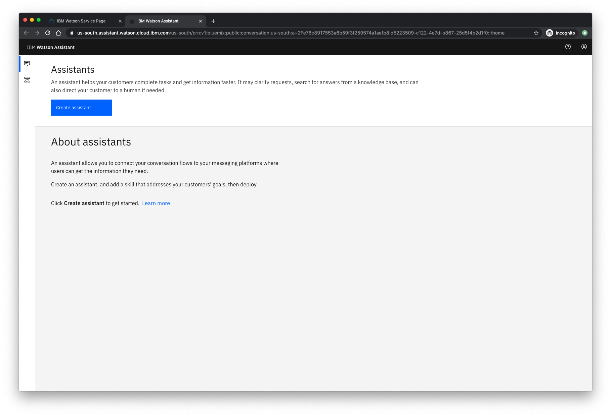

## Create the search skill

Click the Skills icon (second icon down on the far left of the screen), and then click **Create skill**.

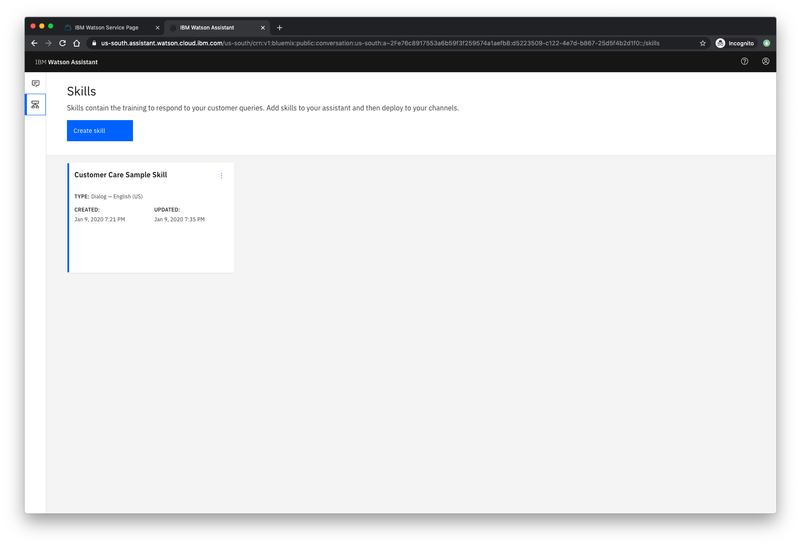

On the next screen, you'll see two options -- Dialog skill and Search skill.

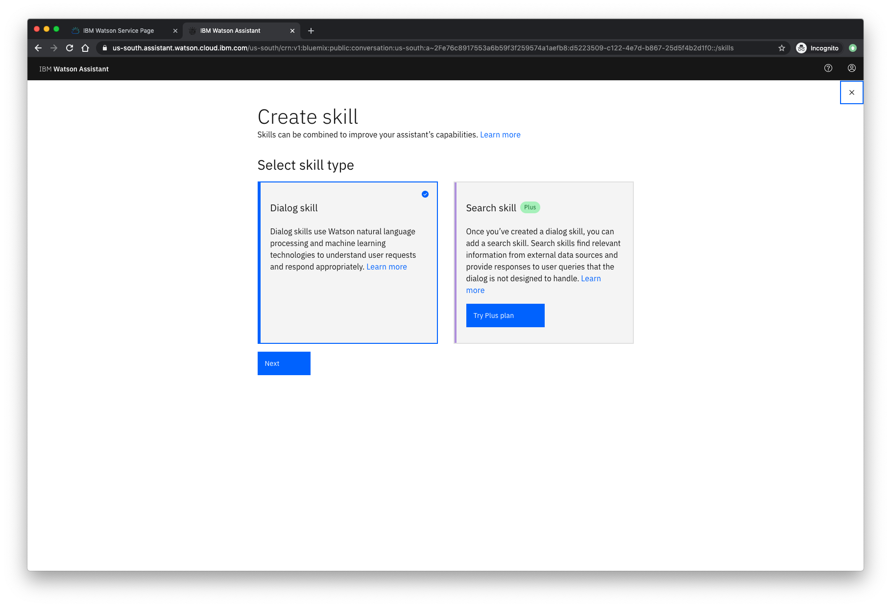

You'll now notice that you're unable to select the Search skill and can only see a button to **Try Plus plan** You can only select the Search skill if you are a Plus or Premium plan user.

So in order to proceed, we'll need to sign up for a trial to the Plus plan for Assistant.

Click on the **Try Plus plan** button.

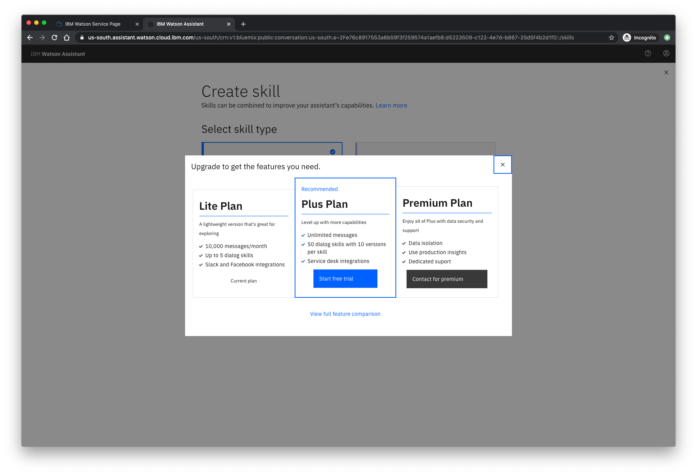

Next, select **Start free trial**

Click on **Agree**. You now have a 30-day trial to the Assistant Plus plan on this account.

Next, click the Search skill tile, and then click Next.

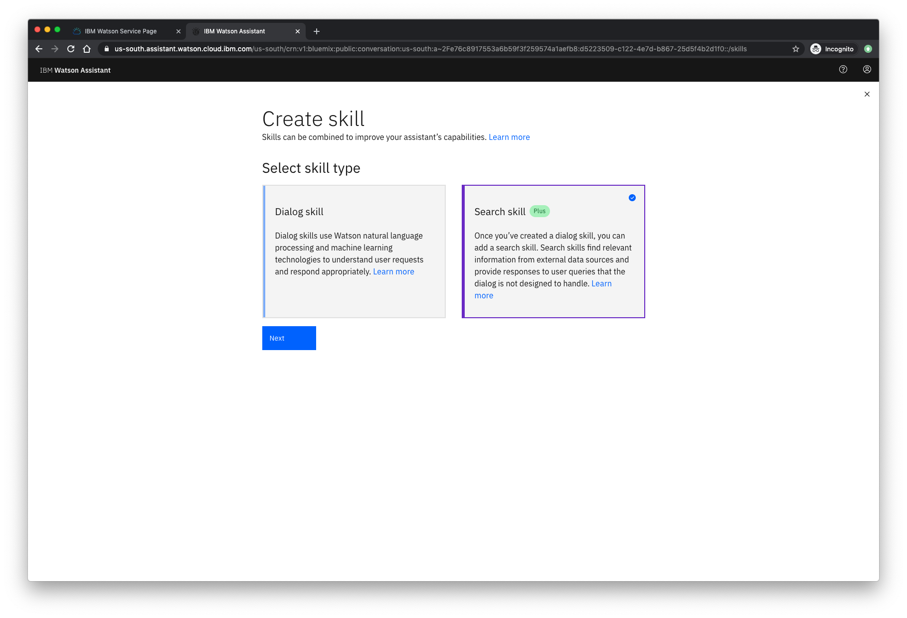

Now, let's specify the details for the new skill:
* Name: A name no more than 100 characters in length (required).
* Description: An optional description no more than 200 characters in length.

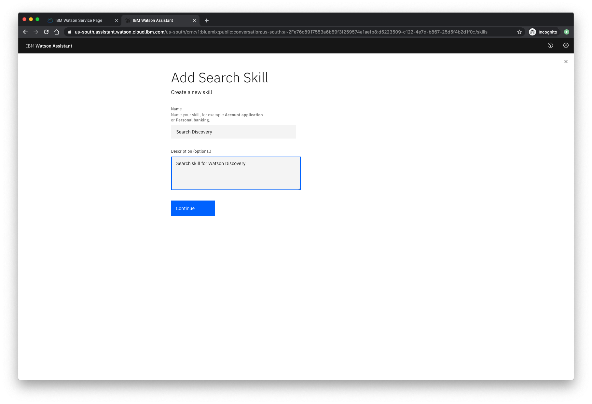

Click **Continue**

## Connect to an existing Watson Discovery service instance

Choose the Discovery service instance that you want to extract information from. Any Discovery service instances that you have access to are displayed in the list. In our case, you should only see a single instance, the one you created earlier in the workshop.

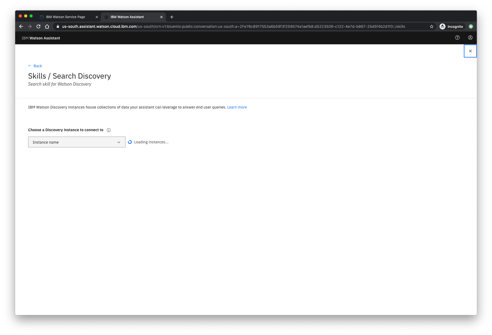

Next, select the data collection to use.

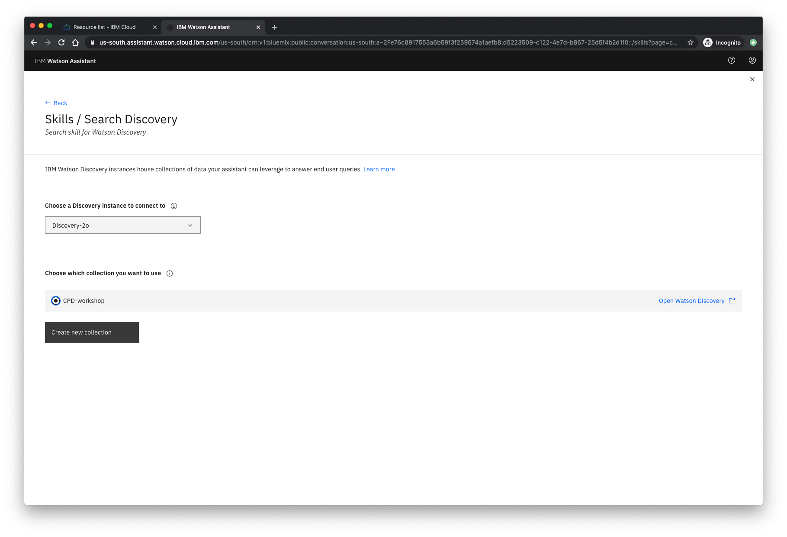

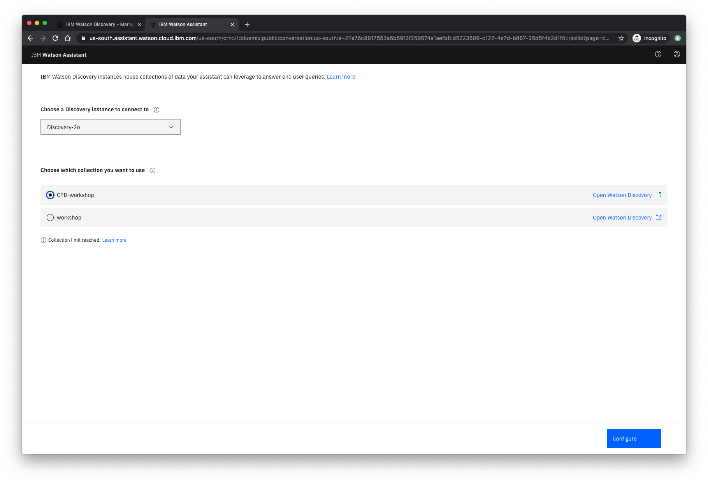

Click **Configure** (you may need to scroll down to see the button)

## Configure the search

On this screen, we'll configure the search skill response.

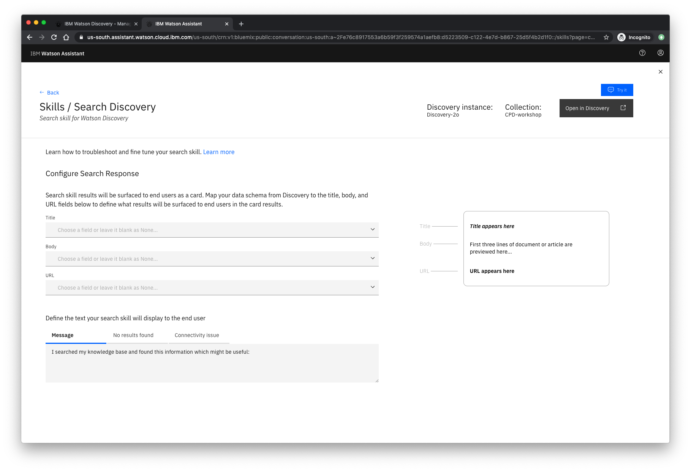

For each of the three fields (Title, Body, URL), choose the Discovery collection fields from which you want to extract text to include in the search result that is returned to the user. The fields that are available differ based on the data you ingested.

Each search result can consist of the following sections:

* **Title**: Search result title. Use the title, name, or similar type of field from the collection as the search result title. (You must select something for the title or no search result response is displayed in the Facebook and Slack integrations.)

* **Body**: Search result description. Use an abstract, summary, or highlight field from the collection as the search result body. (You must select something for the body or no search result response is displayed in the Facebook and Slack integrations.)

* **URL**: This field can be populated with any footer content that you want to include at the end of the search result. For example, you might want to include a hypertext link to the original data object in its native data source. Most online data sources provide self-referencing public URLs for objects in the store to support direct access. If you add a URL, it must be valid and reachable. If it is not, the Slack integration will not include the URL in its response and the Facebook integration will not return any response. The Facebook and Slack integrations can successfully display the search result response when the URL field is empty.

Note: You must choose a value for at least one of the search result sections.

For this workshop, we'll keep it simple and just add the title and body.

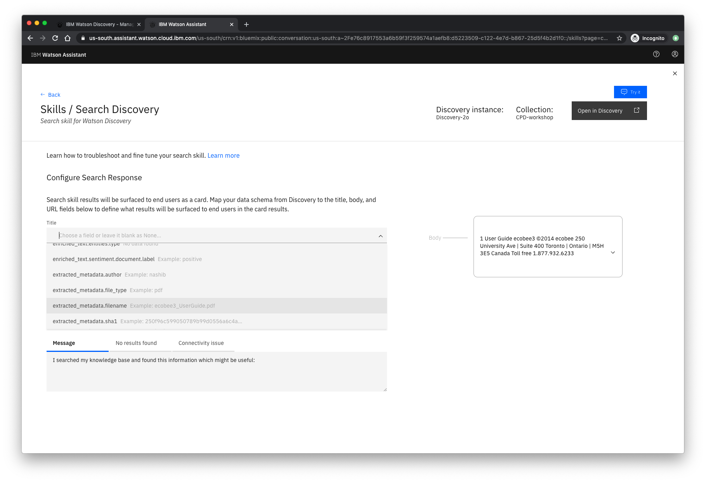

For the title, select `extracted_metadata.filename`:

And for the body, select `text`:

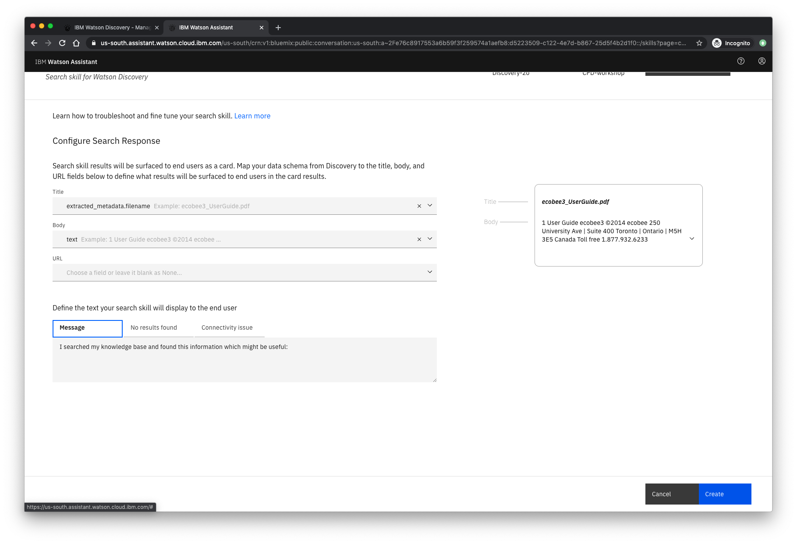

## Test the search skill
Click **Try it** to open the "Try it out" pane for testing. Enter a test message to see the results that are returned when your configuration choices are applied to the search. Make adjustments as necessary.

Try a query like **How do I turn up the heat?**

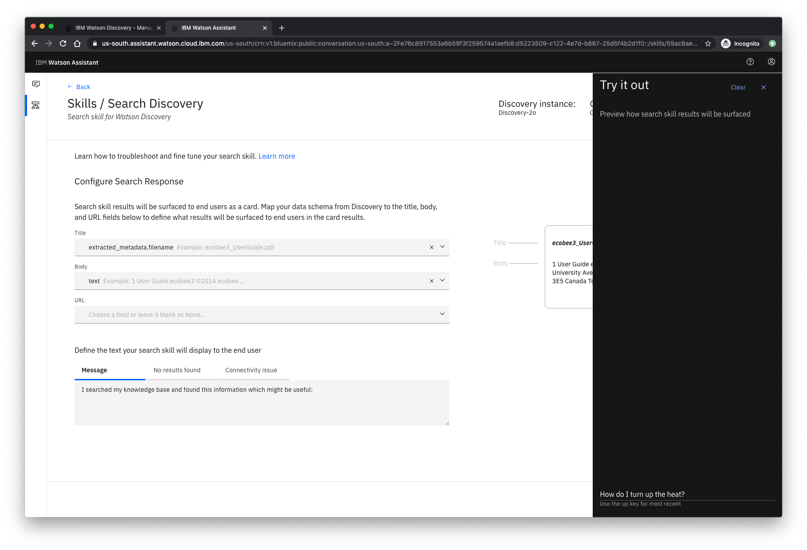
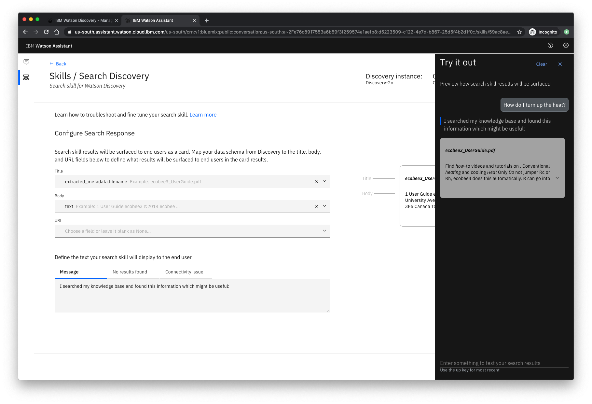
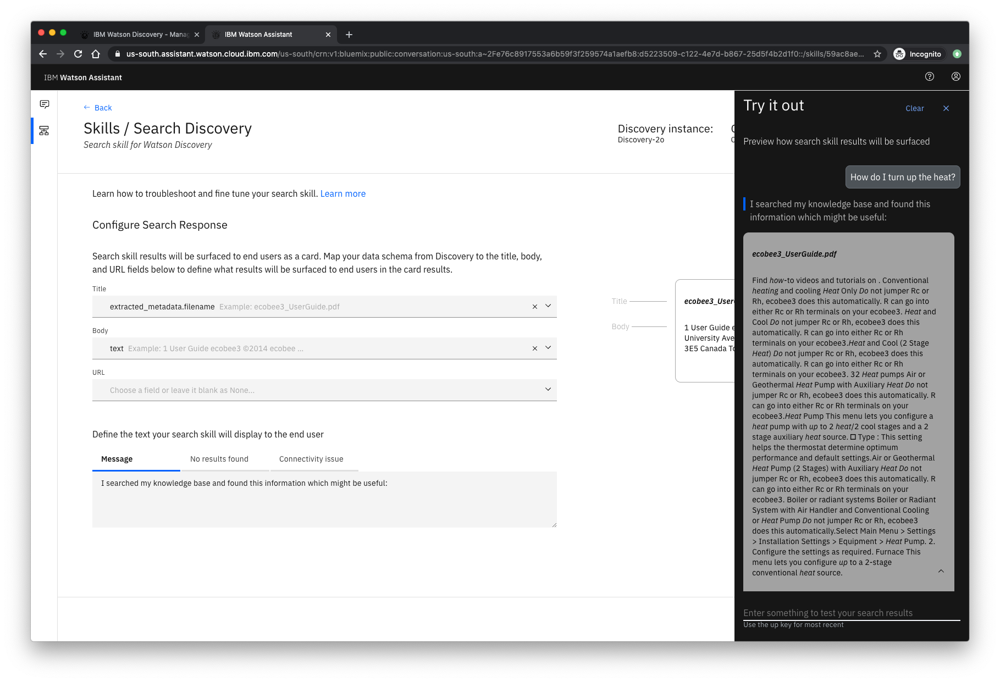

You can see that our question triggered the search skill to search Discovery for the relevant section of the PDF document we uploaded earlier.

Click **Create**

After you create the search kill, it appears as a new tile on the Skills page.

The search skill cannot interact with customers though until it is added to an assistant and the assistant is deployed. 

We'll do that in the next section.
