In this final step, we're going to configure and test the customer care application that ties Watson Discovery and Watson Assistant together in a web-based chatbot application.

In prior steps, we created skills for our Assistant along with configuring and uploading data to Discovery.

Now we're going to create the Assistant and then add the skills we previously configured.

Finally, we'll preview our new customer care application.

## Navigate to Watson Assistant and launch
To get started, go back into Watson Assistant. As a reminder, click on **Launch Watson Assistant** from the CPD dashboard.


After you launch Assistant, you'll see this screen:


## Create an Assistant

From the Assistants page, click to open the tile for the assistant to which you want to add the skill.

Click **Create Assistant**

On the next screen, add a name and description (optional) for the assistant. 

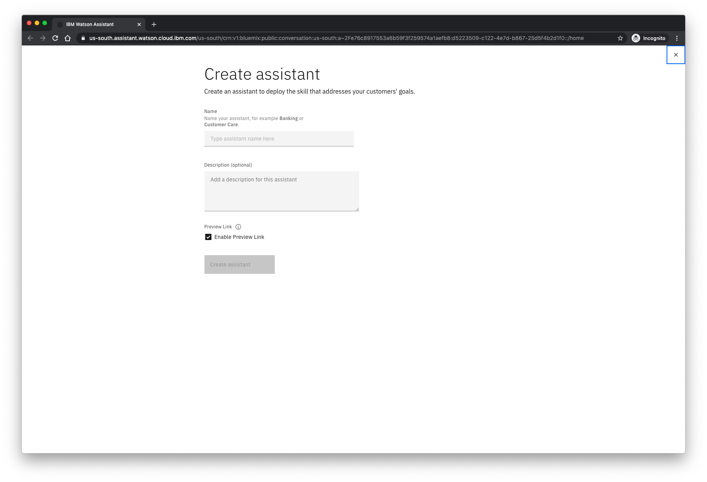

Be sure the checkbox for **Enable Preview Link** is selected.


Click **Create assistant**


## Add the skill to our Assistant

Now that we've created our assistant, we need to finish it by adding our skills.

First, we'll add our dialog skill.


Click **Add dialog skill**


Select the tile for the existing skill. In this case, the **Customer Care Sample Skill**


Now that we've added a dialog skill, the button to add the search skill is now enabled. Let's add it next.

Click **Add search skill**

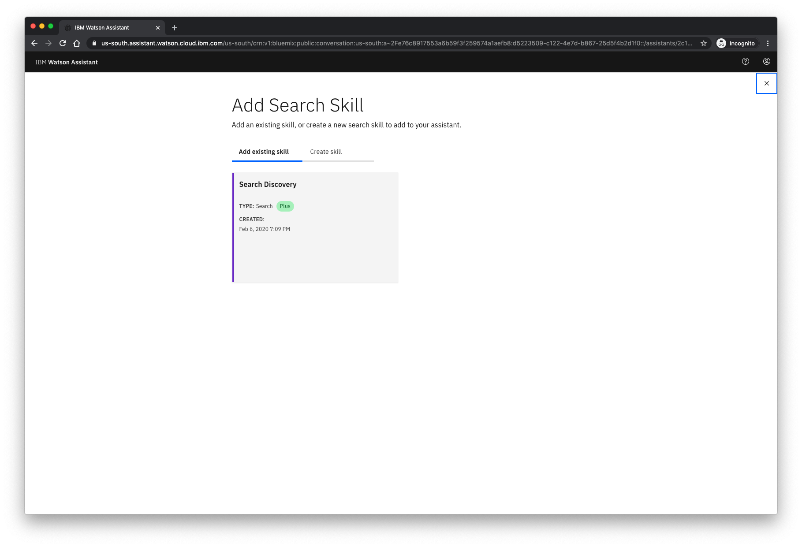

Select the tile for the existing search skill.

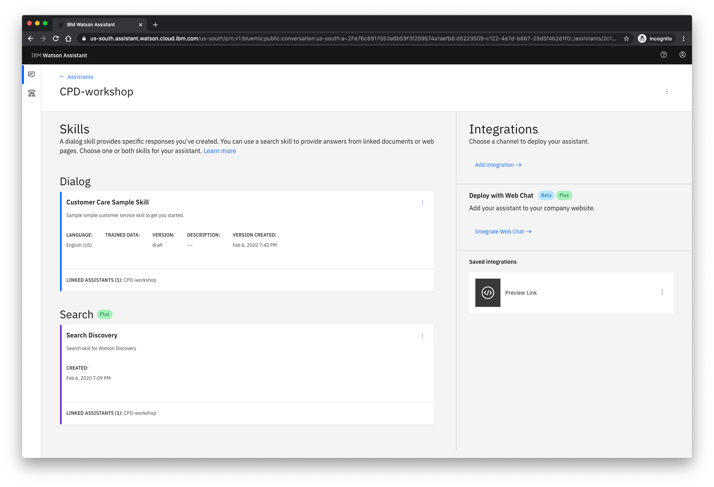

Now both our skills are connected to the assistant.

After you add a search skill to an assistant, it is automatically enabled for the assistant as follows:
* If the assistant has only a search skill, any user input that is submitted to one of the assistant's integration channels triggers the search skill.
* If the assistant has both a dialog skill and a search skill, any user input triggers the dialog skill first. The dialog addresses any user input that it has a high confidence it can answer correctly. Any queries that would normally trigger the `anything_else` node in the dialog tree are sent to the search skill instead.
* If you want a specific search query to be triggered for specific questions, add a search skill response type to the appropriate dialog node.

## Search triggers

The search skill is triggered in the following ways:
* **Anything else node**: Searches an external data source for a relevant answer when none of the dialog nodes can address the user's query. Instead of showing a standard message, such as `I don't know how to help you with that.` the assistant can say, `Maybe this information can help:` followed by the passage returned by the search. If a search skill is linked to your assistant, then whenever the `anything_else` node is triggered, rather than displaying the node response, a search occurs instead. The assistant passes the user input as the query to your search skill, and returns the search results as the response.
* **Search response type**: If you add a search response type to a dialog node, then your assistant retrieves a passage from an external data source and returns it as the response to a particular question. This type of search occurs only when the individual dialog node is processed. This approach is useful if you want to narrow down a user query before you trigger a search. For example, the dialog branch might collect information about the type of device the customer wants to buy. When you know the make and model, you can then send a model keyword in the query that is submitted to the search skill, and get better results.
* **Search skill only**: If only a search skill is linked to an assistant, and no dialog skill is linked to the assistant, then a search query is sent to the Discovery service when any user input is received from one of the assistant's integration channels.


## Test a preview

To test the full experience that customers will have when they ask questions that are either answered by the dialog or trigger a search, use a channel integration, such as the preview link.

Configure at least one integration channel to test the search skill. In the channel, enter queries that trigger the search. If you initiate any type of search from your dialog, test the dialog to ensure that the search is triggered as expected. If you are not using search response types, test that a search is triggered only when no existing dialog nodes can address the user input. And any time a search is triggered, ensure that it returns meaningful results.

Click on **Preview Link**

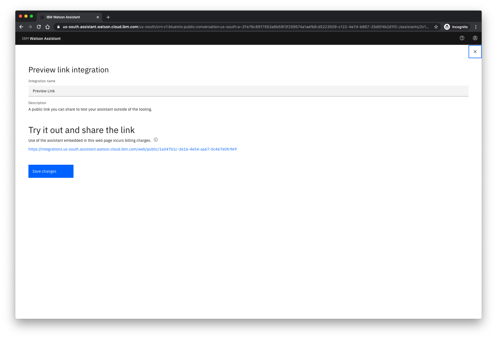

On the **Preview link integration** page, enter a name and description.

You'll notice that the integration provides you with a URL for our embedded assistant. Copy this URL or open it in another browser tab.

Example: `https://integrations.us-south.assistant.watson.cloud.ibm.com/web/public/1a047b1c-3616-4e54-aa67-0c467e0fc9e9`

Click **Save changes**

Now go to the URL above in another browser tab.

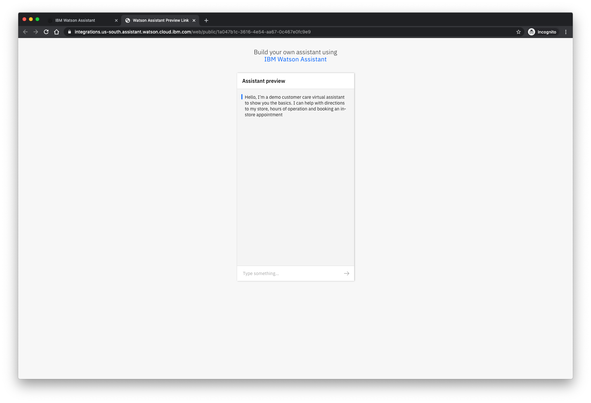

Let's first try out some basic customer care questions to test our dialog skill.

Try entering some of the following:

* What are your hours?
* Can you provide directions?


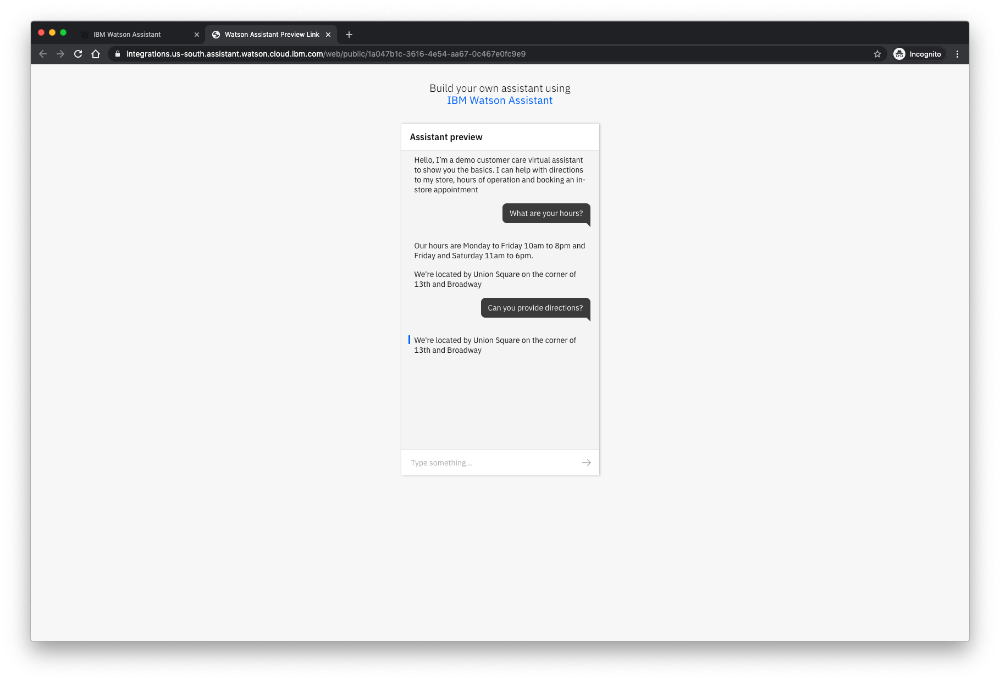

Now let's try our search skill. Then try entering some of these sample questions and examine the results:

* **How do I set the temperature?**
* **How do I set the time?**
* **How do I set a schedule?**

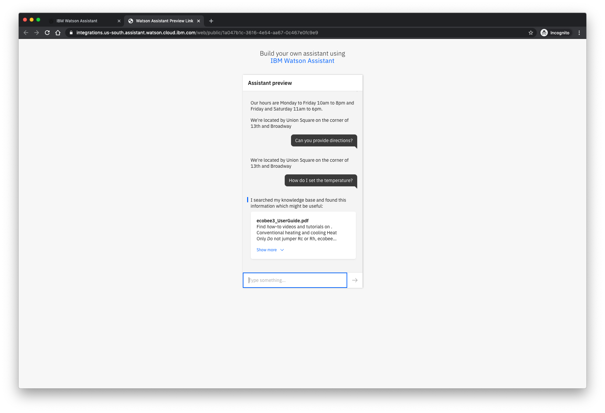
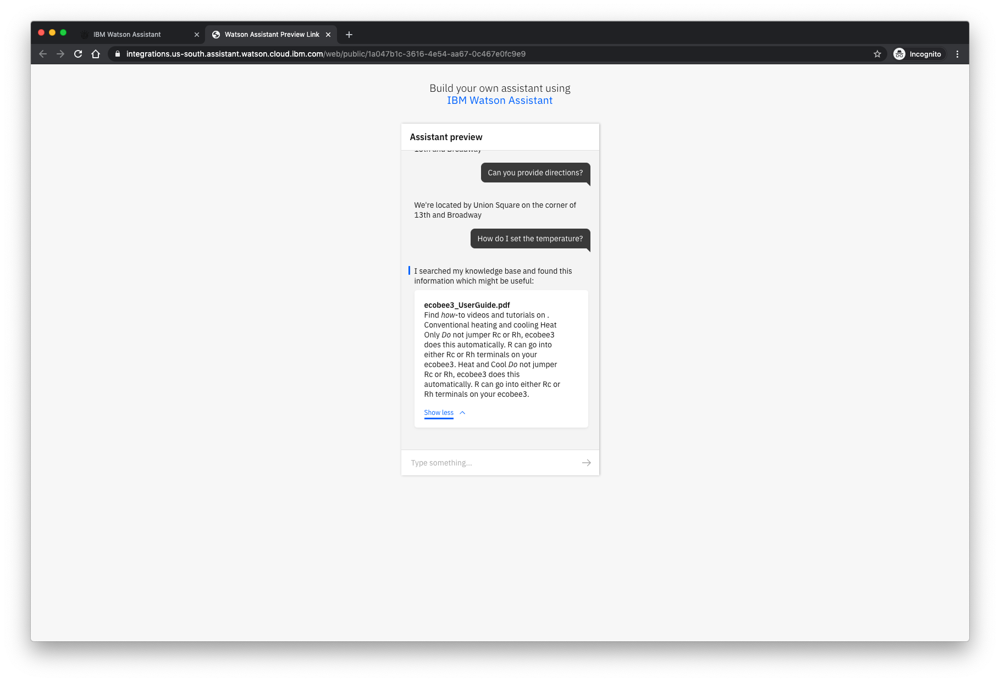

## Web chat integration
While the preview above is great for testing, it's not really usable for production. Let's now take a look at a better integration option.


From our Skills page, let's add a new integration, this time Web Chat.

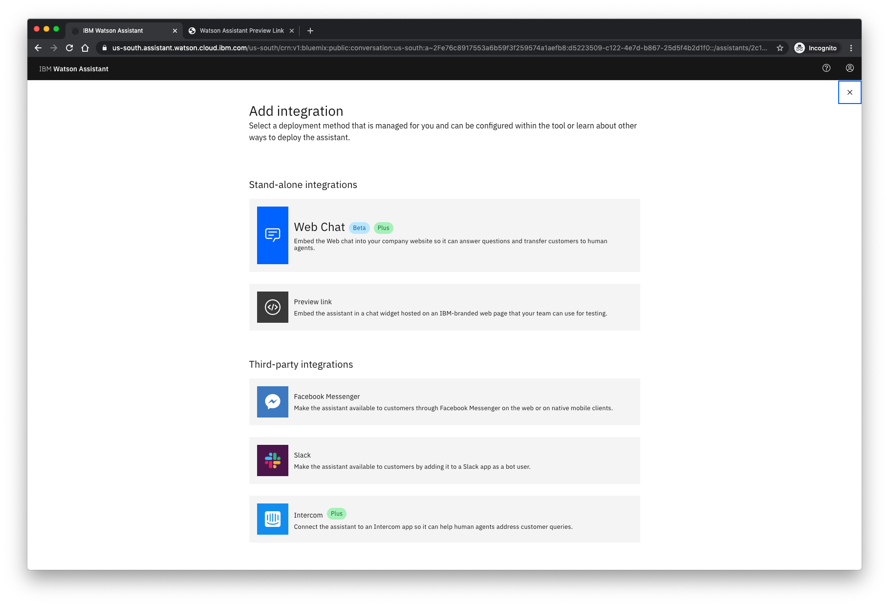

Click on **Web Chat**

"Embed the assistant in your company website
Drop this embeddable chat UI into any website pages where you want customers to get help from your assistant."

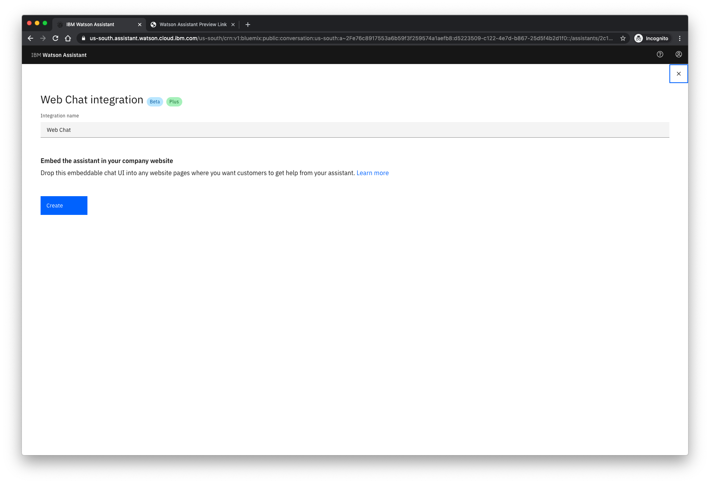

Enter a name and then click **Create**


On the Web Chat integration page, we can both customize the chat UI and grab the code snippet to embed it on a web page.

First enter a name for the assistant. Then, optionally, change the font family and accent color to your tastes.

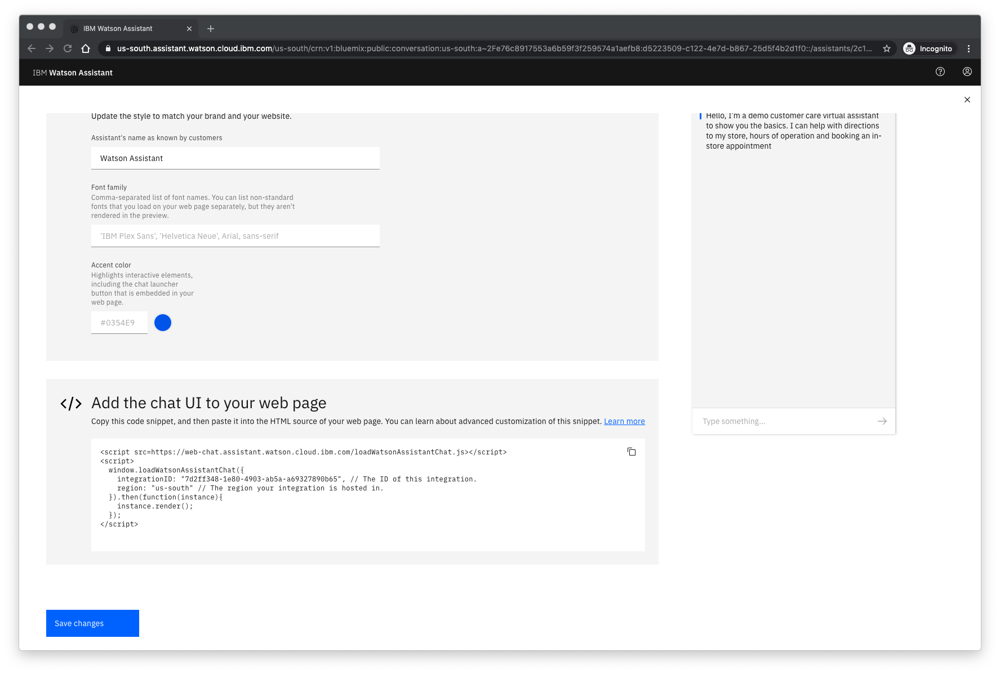

Once it looks good to you, copy the code snippet and save it for a future step.

Here's an example of the code snippet:
```javascript
<script src=https://web-chat.assistant.watson.cloud.ibm.com/loadWatsonAssistantChat.js></script>
<script>
  window.loadWatsonAssistantChat({
    integrationID: "7d2ff348-1e80-4903-ab5a-a69327890b65", // The ID of this integration.
    region: "us-south" // The region your integration is hosted in.
  }).then(function(instance){
    instance.render();
  });
</script>
```

Next, after copying the code, click **Save changes**

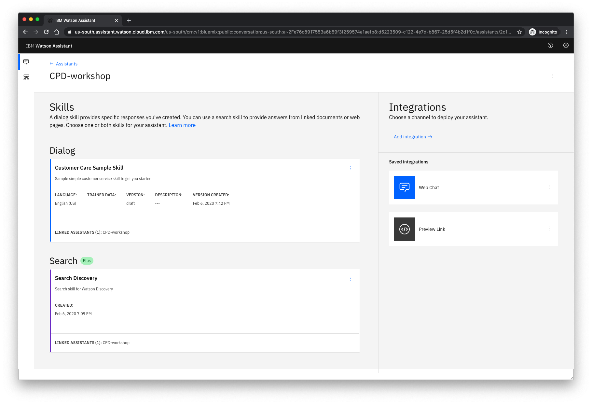

On our Skills page, we now have two integrations displayed: Web Chat and Preview Link.

https://cloud.ibm.com/docs/services/assistant?topic=assistant-deploy-web-chat

## Deploy/integrate the web chat integration
Next, we'll embed our assistant on a web page as a chat widget. This should give you a good idea of how you could integrate with your company's website.

Navigate to the directory for the sample web page code:

```bash
cd /ibm-cpd-workshop/assistant/app/
```

Next, copy the code snippet saved above to the `index.html` file.

```html
<html>
<head></head>
<body>
    <title>My Test Page</title>
    <p>The body of my page.</p>
    <!-- paste copied script here -->
    </body>
</html>
```

Now we can test it in a web browser. Navigate to `http://127.0.0.1:4000/ibm-cpd-workshop/assistant/app/index.html` in your web browser.

Initially, you'll see an icon appear in the lower right hand corner of the screen:


Click on this icon to open the assistant.


Try some queries again in the assistant to verify it works as expected.

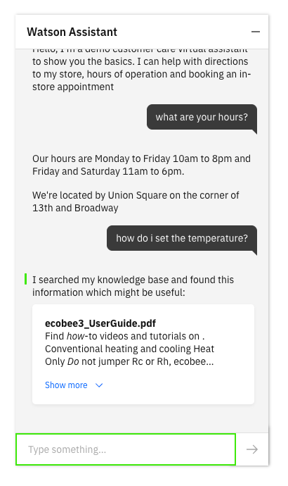

On your own site, you'd paste the code snippet on each web page where you want the assistant to be available to your customers.

You can paste the same script tag into as many pages on your website as you want. Add it anywhere where you want users to be able to reach your assistant for help. However, be sure to add it only one time per page.

Note: If you don't extend the session timeout setting for the assistant, the dialog flow for the current session is restarted after 60 minutes of inactivity. This means that if a user stops interacting with the assistant, after 60 minutes, any context variable values that were set during the previous conversation are set to null or back to their initial values.

## Extending the Web Chat
You can make more advanced customizations and extend the capability of the Web Chat by using the Watson Assistant Web Chat toolkit on [GitHub](https://watson-developer-cloud.github.io/assistant-web-chat/index.html).


This GitHub repository is for developers who have deployed Web Chat from Watson Assistant and are looking to embed, configure, customize and extend their Web Chat instance. As a reminder, Web Chat is only available to Plus or Premium Watson Assistant plans.

If you choose to use the provided methods, you implement them by editing the code snippet that was generated earlier. You then embed the edited code snippet into your web page.

Some additional documentation can also be found [here](https://cloud.ibm.com/docs/services/assistant?topic=assistant-deploy-web-chat#deploy-web-chat-extend).
